# AdventureMate - Class Diagram

## Overview

This class diagram represents the core React frontend architecture of AdventureMate, organized by modules.

## Core Class Diagram

```mermaid
classDiagram
    %% External Services
    class StripeService {
        +processPayment(amount, currency)
        +createPaymentIntent()
        +confirmPayment()
    }

    class MapboxService {
        +geocode(address)
        +reverseGeocode(coordinates)
        +getDirections(from, to)
    }

    class CloudinaryService {
        +uploadImage(file)
        +resizeImage(url, width, height)
        +deleteImage(publicId)
    }

    class GoogleOAuthService {
        +getGoogleOAuthURL()
        +handleGoogleOAuthCallback(code, onSuccess, onError)
        +extractAuthCodeFromURL(url)
        +clearOAuthParamsFromURL()
        +initializeGoogleOAuth()
    }

    %% Core Context Classes
    class AuthContext {
        +currentUser: User
        +loading: boolean
        +login(email, password)
        +logout()
        +register(userData)
        +googleLogin(code, redirectUri)
    }

    class UserContext {
        +user: User
        +updateUser(userData)
    }

    %% Core Hook Classes
    class ApiHook {
        +data: any
        +loading: boolean
        +error: Error
        +fetchData(url)
        +postData(url, payload)
        +putData(url, payload)
        +deleteData(url)
    }

    %% Layout Components
    class Layout {
        +user: User
        +handleLogout()
        +render()
    }

    class ProtectedRoute {
        +user: User
        +requiredRole: string
        +render()
    }

    %% Auth Module
    class LoginForm {
        +email: string
        +password: string
        +handleSubmit()
        +render()
    }

    class RegisterForm {
        +userData: Object
        +handleSubmit()
        +render()
    }

    class GoogleOAuthButton {
        +isLoading: boolean
        +handleGoogleLogin()
        +render()
    }

    class GoogleOAuthCallbackPage {
        +status: string
        +handleOAuthCallback()
        +render()
    }

    class ProfilePage {
        +user: User
        +handleUpdateProfile()
        +render()
    }

    %% Campgrounds Module
    class CampgroundService {
        +campgrounds: Array
        +fetchCampgrounds()
        +createCampground(data)
        +updateCampground(id, data)
    }

    class CampgroundCard {
        +campground: Campground
        +startingPrice: number
        +render()
    }

    class CampgroundList {
        +campgrounds: Array
        +fetchCampgrounds()
        +render()
    }

    class CampgroundDetail {
        +campground: Campground
        +campsites: Array
        +reviews: Array
        +render()
    }

    class HomePage {
        +campgrounds: Array
        +render()
    }

    class CampgroundsPage {
        +campgrounds: Array
        +render()
    }

    %% Booking Module
    class BookingService {
        +bookings: Array
        +fetchBookings()
        +createBooking(data)
        +cancelBooking(id)
    }

    class BookingForm {
        +booking: Booking
        +campsite: Campsite
        +handleSubmit()
        +render()
    }

    class ReviewForm {
        +review: Review
        +rating: number
        +handleSubmit()
        +render()
    }

    %% Owner Module
    class OwnerLayout {
        +user: User
        +render()
    }

    class OwnerDashboard {
        +stats: Object
        +recentBookings: Array
        +render()
    }

    class OwnerCampgroundsPage {
        +campgrounds: Array
        +render()
    }

    %% Admin Module
    class AdminLayout {
        +user: User
        +render()
    }

    class AdminAnalytics {
        +analytics: Object
        +render()
    }

    class AdminBookingsPage {
        +bookings: Array
        +render()
    }

    %% Core Relationships
    AuthContext --> ApiHook : uses
    UserContext --> ApiHook : uses

    ApiHook --> StripeService : integrates with
    ApiHook --> MapboxService : integrates with
    ApiHook --> CloudinaryService : integrates with
    ApiHook --> GoogleOAuthService : integrates with

    ApiHook --> CampgroundCard : used by
    ApiHook --> CampgroundList : used by
    ApiHook --> BookingForm : used by
    ApiHook --> ReviewForm : used by

    CampgroundService --> CampgroundList : provides
    CampgroundService --> CampgroundDetail : provides
    CampgroundService --> OwnerCampgroundsPage : provides

    BookingService --> BookingForm : provides
    BookingService --> AdminBookingsPage : provides

    %% Auth Module Relationships
    AuthContext --> GoogleOAuthButton : provides googleLogin
    AuthContext --> GoogleOAuthCallbackPage : provides googleLogin
    GoogleOAuthButton --> GoogleOAuthService : uses
    GoogleOAuthCallbackPage --> GoogleOAuthService : uses

    %% Module Relationships
    Layout --> LoginForm : contains
    Layout --> RegisterForm : contains
    Layout --> ProfilePage : contains
    LoginForm --> GoogleOAuthButton : contains

    HomePage --> CampgroundCard : contains
    CampgroundsPage --> CampgroundList : contains
    CampgroundDetail --> ReviewForm : contains
    CampgroundDetail --> BookingForm : contains

    OwnerLayout --> OwnerDashboard : contains
    OwnerLayout --> OwnerCampgroundsPage : contains

    AdminLayout --> AdminAnalytics : contains
    AdminLayout --> AdminBookingsPage : contains

    ProtectedRoute --> OwnerLayout : protects
    ProtectedRoute --> AdminLayout : protects
    ProtectedRoute --> ProfilePage : protects
```

## Module Architecture

### **External Services**

- **StripeService**: Payment processing
- **MapboxService**: Maps and geolocation
- **CloudinaryService**: Image upload and management
- **GoogleOAuthService**: Google OAuth authentication

### **Core Infrastructure**

- **AuthContext**: Global authentication state (includes Google OAuth)
- **UserContext**: User profile management
- **ApiHook**: Generic API interactions
- **Layout**: Common layout wrapper (Header + Footer)
- **ProtectedRoute**: Role-based access control

### **Auth Module**

- **LoginForm**: User login (includes Google OAuth button)
- **RegisterForm**: User registration
- **GoogleOAuthButton**: Google OAuth login component
- **GoogleOAuthCallbackPage**: Handles OAuth callback
- **ProfilePage**: User profile management

### **Campgrounds Module**

- **CampgroundService**: Campground data management
- **CampgroundCard**: Individual campground display
- **CampgroundList**: List of campgrounds
- **CampgroundDetail**: Detailed campground view
- **HomePage**: Landing page with featured campgrounds
- **CampgroundsPage**: Browse all campgrounds

### **Booking Module**

- **BookingService**: Booking data management
- **BookingForm**: Create new bookings
- **ReviewForm**: Write campground reviews

### **Owner Module**

- **OwnerLayout**: Owner-specific layout
- **OwnerDashboard**: Owner analytics and overview
- **OwnerCampgroundsPage**: Manage owner's campgrounds

### **Admin Module**

- **AdminLayout**: Admin-specific layout
- **AdminAnalytics**: System-wide analytics
- **AdminBookingsPage**: Manage all bookings

## Data Flow

1. **External Services** provide specialized functionality (including Google OAuth)
2. **Context** provides global state (AuthContext handles Google OAuth)
3. **Custom Hooks** handle API interactions
4. **Services** manage domain-specific data
5. **Components** render UI within modules
6. **Layout** provides common structure

## Google OAuth Integration

### **Components**

- **GoogleOAuthButton**: Initiates OAuth flow
- **GoogleOAuthCallbackPage**: Handles OAuth callback
- **GoogleOAuthService**: Utility functions for OAuth

### **Flow**

1. User clicks Google OAuth button
2. GoogleOAuthService generates authorization URL
3. User redirected to Google consent screen
4. Google redirects back to GoogleOAuthCallbackPage
5. Callback page extracts code and calls AuthContext.googleLogin()
6. AuthContext completes authentication via API

This modular architecture shows clear separation of concerns and system integrations, including comprehensive Google OAuth support!
