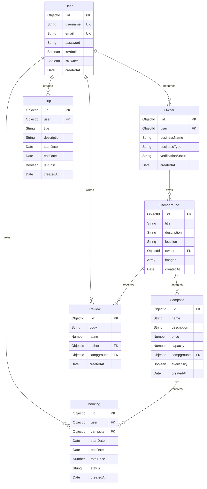

# AdventureMate - Entity Relationship Diagram

## Overview

AdventureMate is a camping booking platform that connects campers with campground owners.

## Core ER Diagram

## Key Features

### 1. **User Management**

- Regular users can book campsites and write reviews
- Users can become campground owners
- Admin users have special privileges

### 2. **Campground System**

- Owners manage campgrounds
- Each campground contains multiple campsites
- Campsites have individual pricing and availability

### 3. **Booking System**

- Users book specific campsites for date ranges
- System tracks booking status and payments

### 4. **Review System**

- Users can review campgrounds with ratings
- 1-5 star rating system

### 5. **Trip Planning**

- Users can create and share trip itineraries
- Public and private trip options

## Simple Flow

1. **Owner** creates **Campground** with multiple **Campsites**
2. **User** books a **Campsite** for specific dates
3. **User** writes **Review** for the **Campground**
4. **User** can plan **Trips** and share with others

This simplified diagram shows the core functionality without overwhelming detail!
