# AdventureMate - Sequence Diagram

## Overview

This sequence diagram shows the key user flows and system interactions in the AdventureMate platform based on the actual codebase implementation.

## 1. User Registration & Email Verification Flow

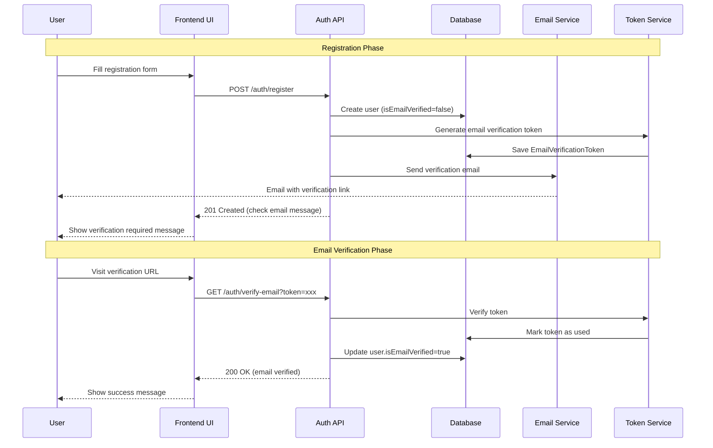

## 2. User Login & Authentication Flow

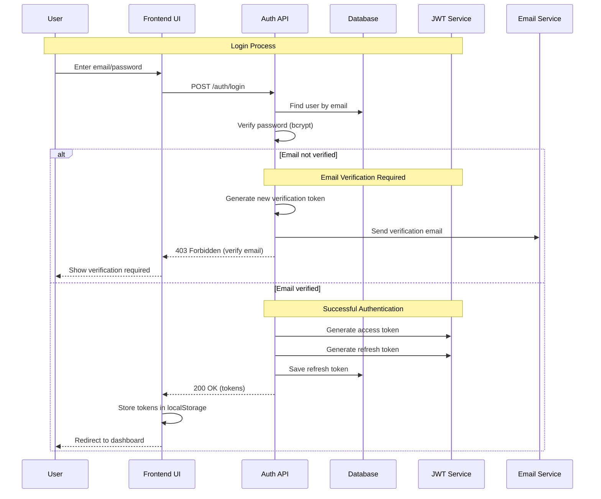

## 3. Google OAuth Login Flow

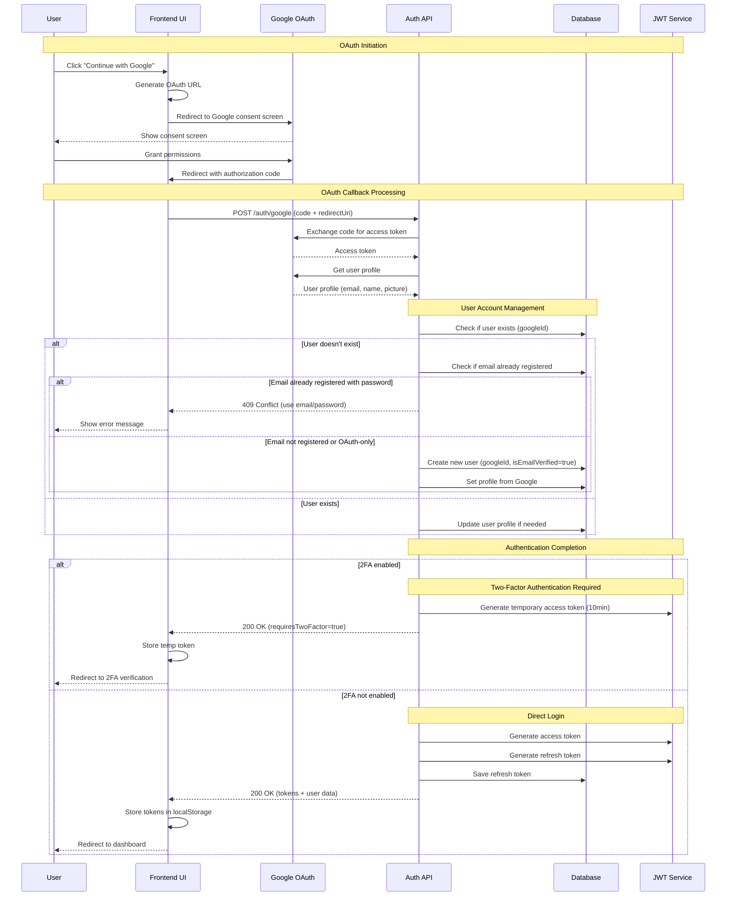

## 4. Owner Application & Verification Flow

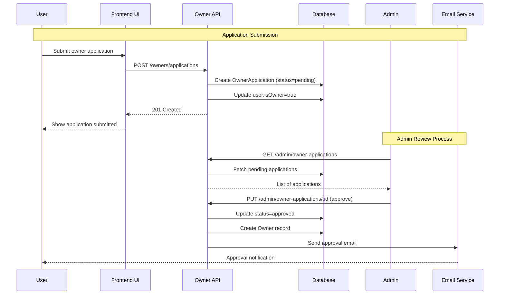

## 5. Campground Creation Flow

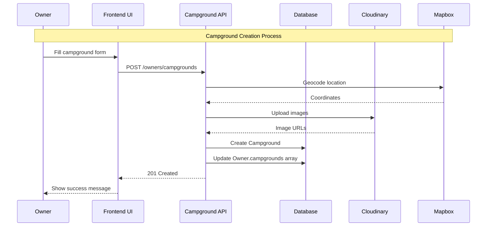

## 6. Campsite Booking Flow

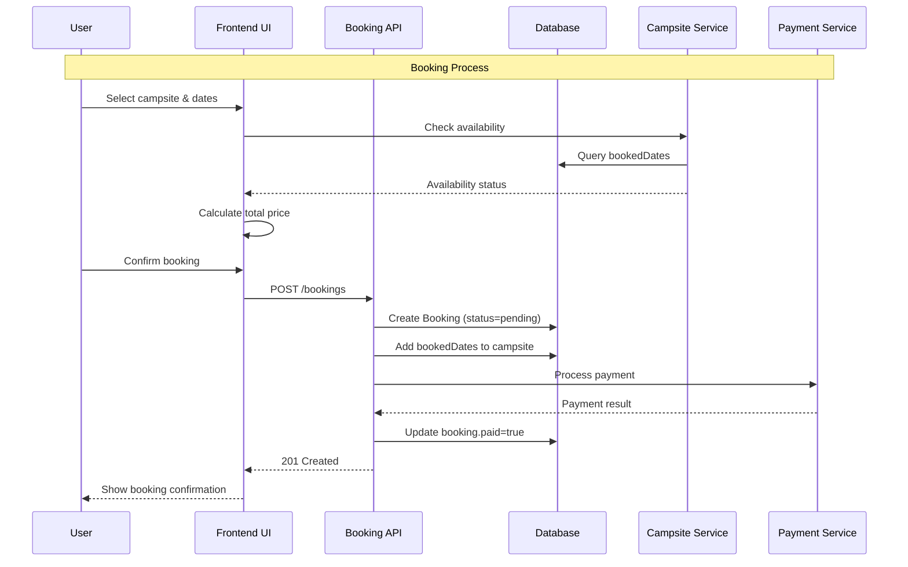

## 7. Owner Booking Management Flow

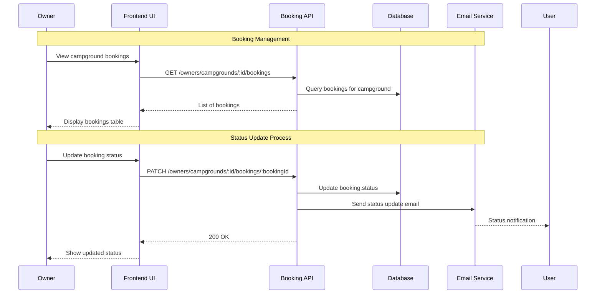

## 8. Trip Planning Flow

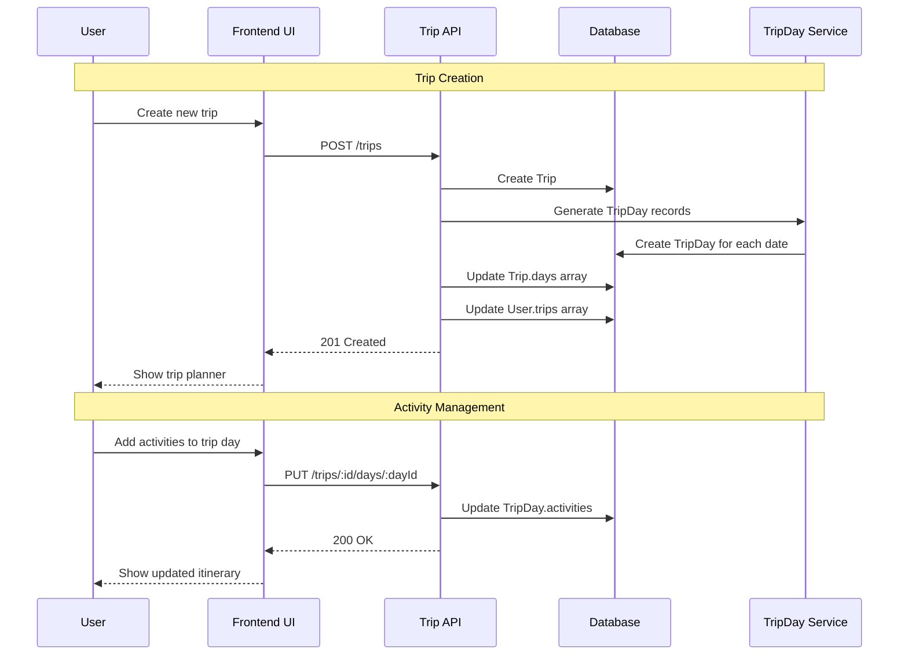

## 9. Review System Flow

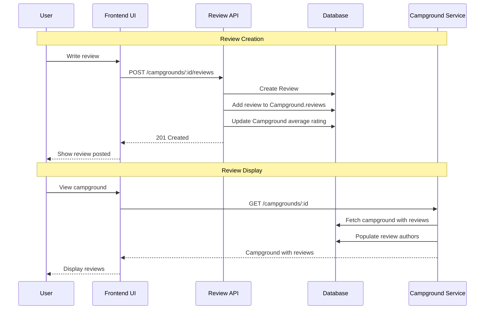

## 10. Safety Alert Flow

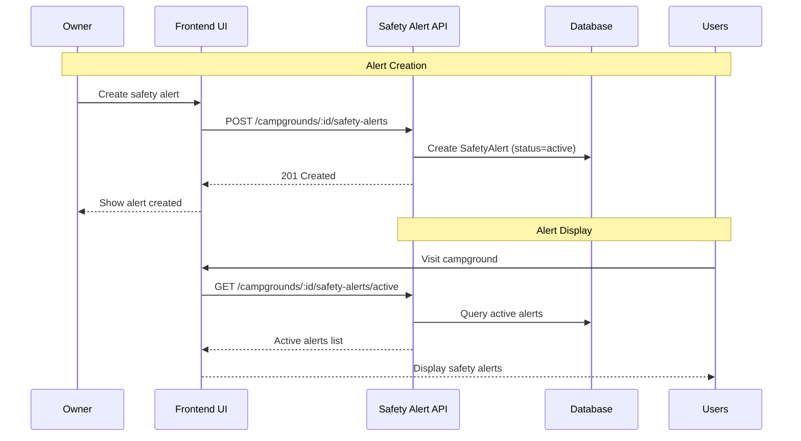

## 11. Admin Analytics Flow

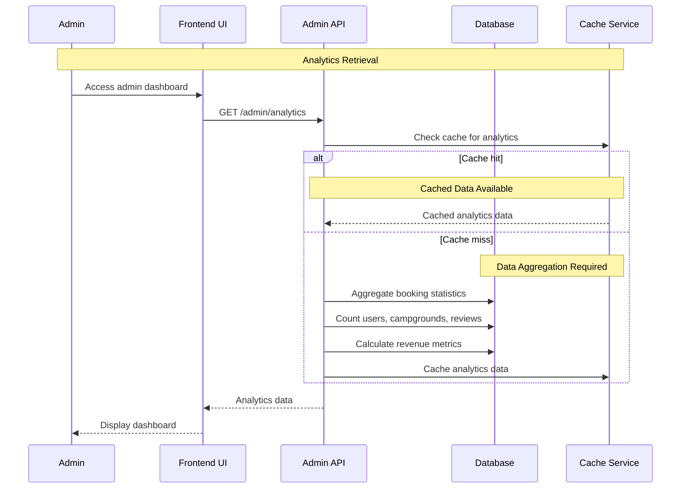

## 12. Password Reset Flow

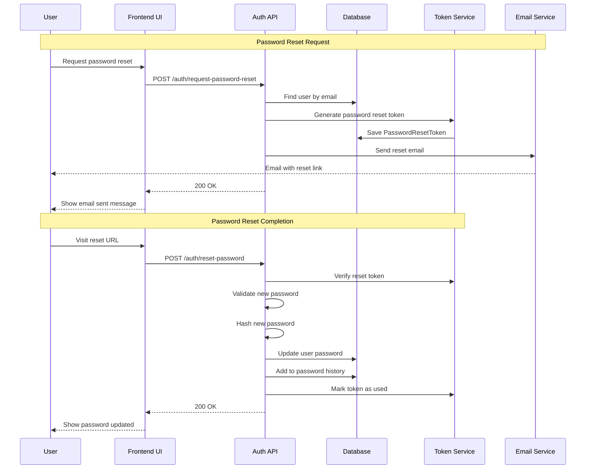

## 13. Trip Collaboration Flow

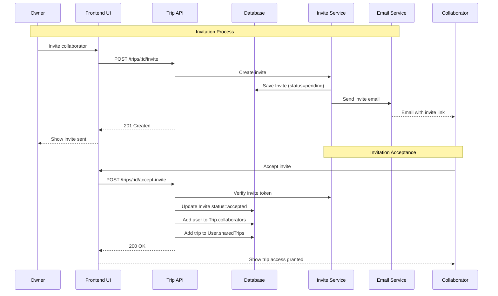

## Key System Interactions

### **Authentication & Security**

- JWT tokens for session management
- Email verification for account security
- Google OAuth integration with 2FA support
- Password reset with time-limited tokens
- Account locking for failed login attempts

### **Data Management**

- MongoDB for data persistence
- Redis for caching (analytics, campgrounds)
- Cloudinary for image storage
- Mapbox for geocoding

### **Business Logic**

- Owner verification controls campground management
- Booking availability prevents double-booking
- Trip planning with collaboration features
- Safety alerts for emergency notifications

### **User Experience**

- Real-time availability checking
- Email notifications for status changes
- PDF export for trip itineraries
- Multi-language support

This sequence diagram accurately represents the key user flows and system interactions in your AdventureMate platform!
