# AdventureMate - State Diagram

## Overview

This state diagram accurately represents the different states and transitions for all entities in the AdventureMate platform based on the actual codebase implementation.

## 1. User Account States

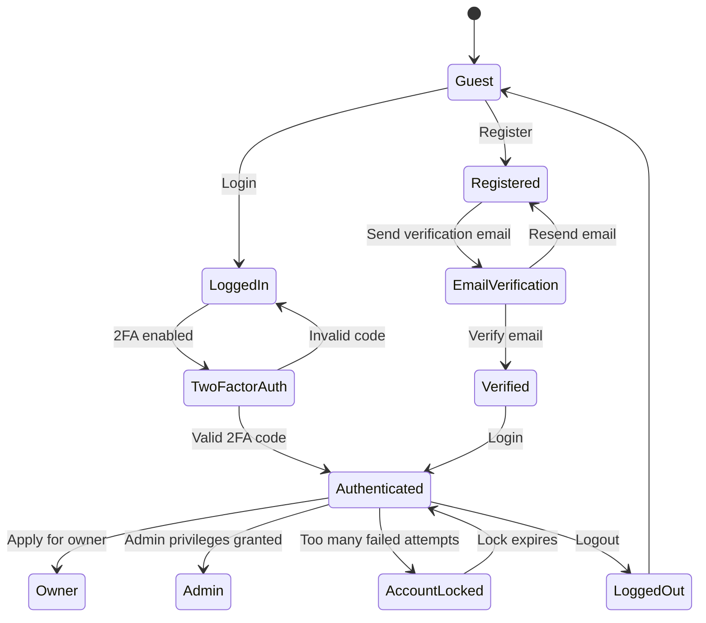

## 2. Owner Application & Verification States

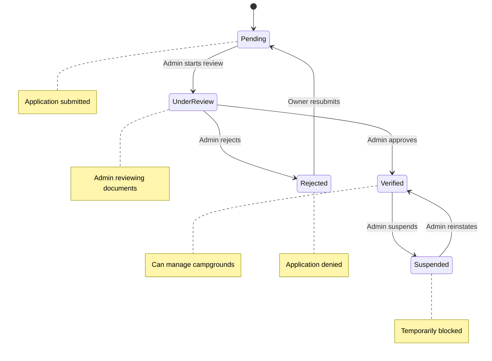

## 3. Campground Lifecycle (No Status Field)

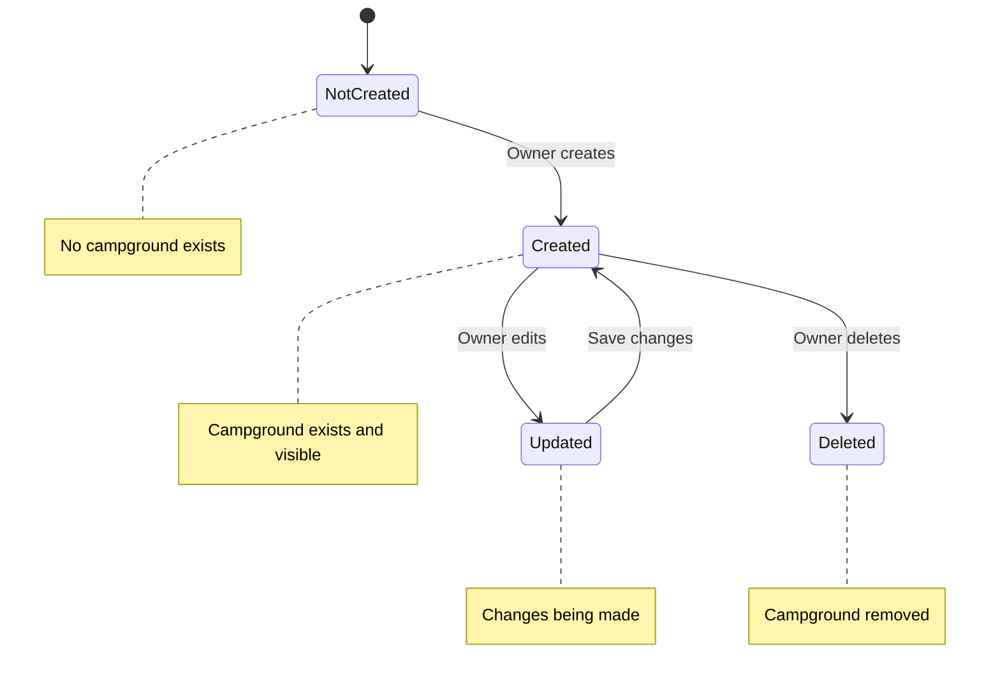

## 4. Campsite States (Based on Actual Model)

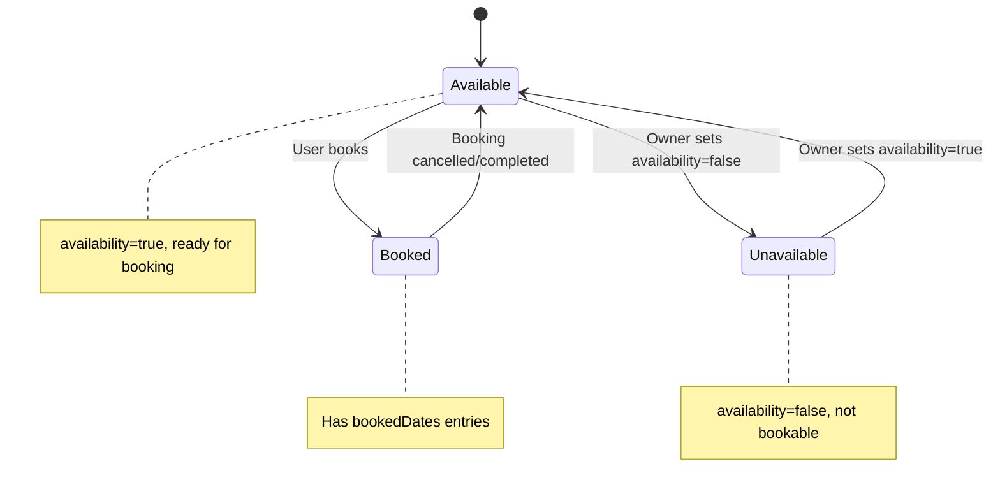

## 5. Booking States (Actual Implementation)

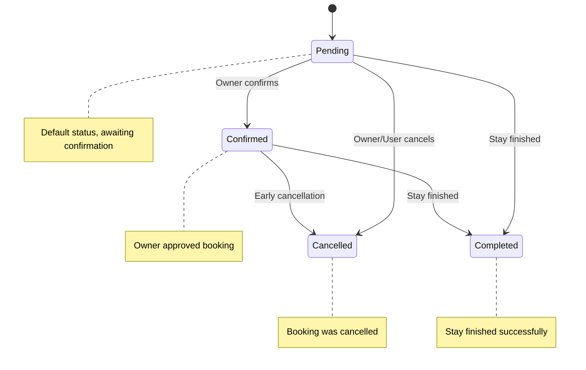

## 6. Review States (No Status Field in Model)

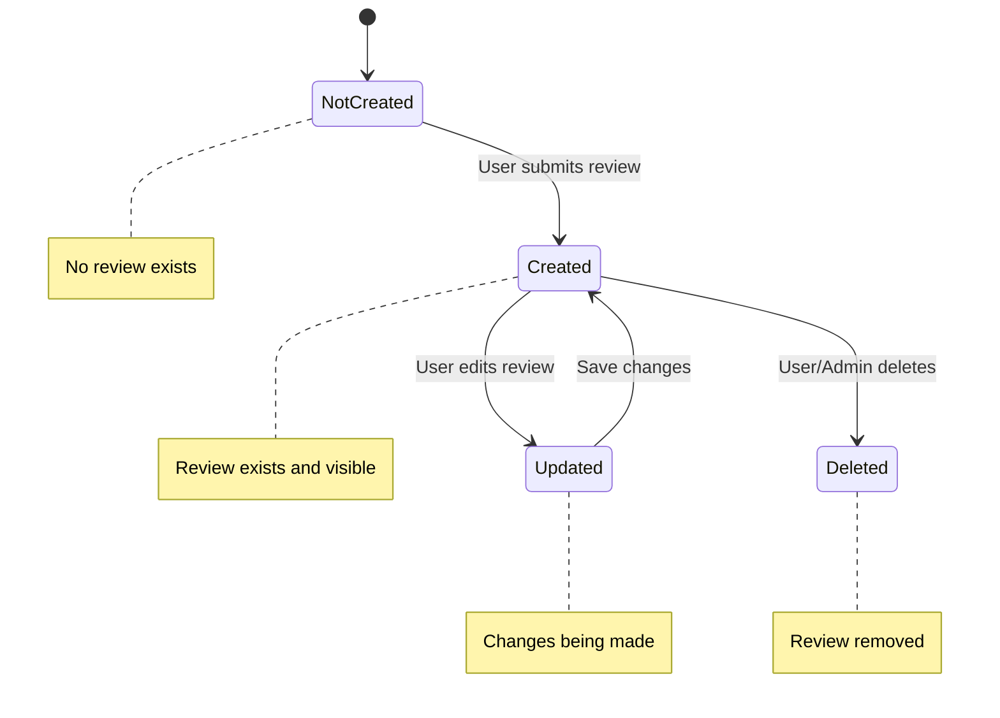

## 7. Trip States (Based on Actual Model)

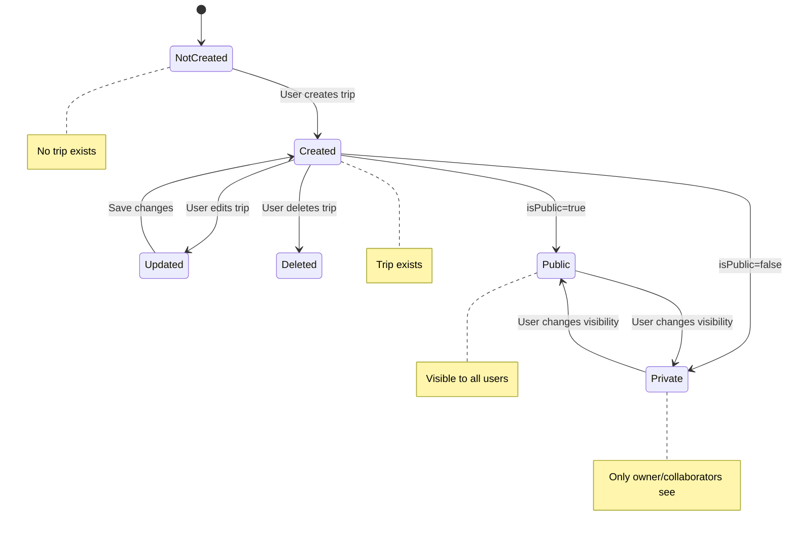

## 8. Trip Day States

## 9. Safety Alert States (Actual Implementation)

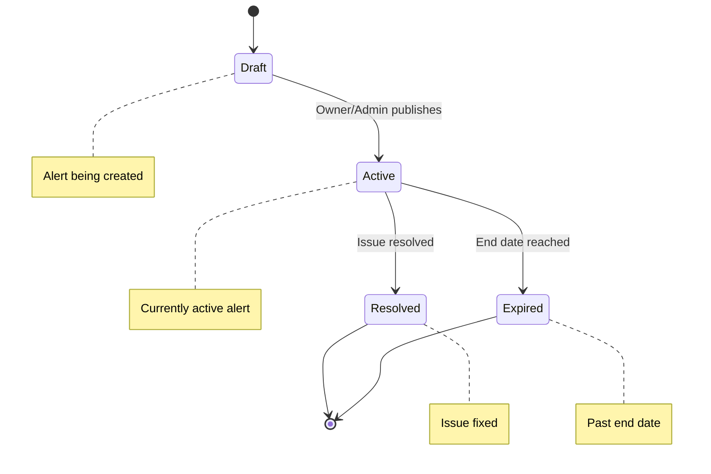

## 10. Email Verification Token States

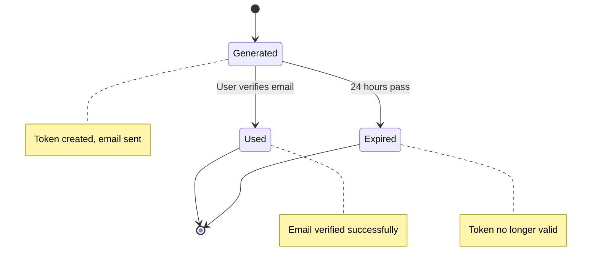

## 11. Password Reset Token States

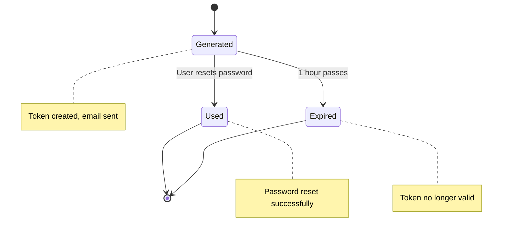

## 12. Trip Invite States

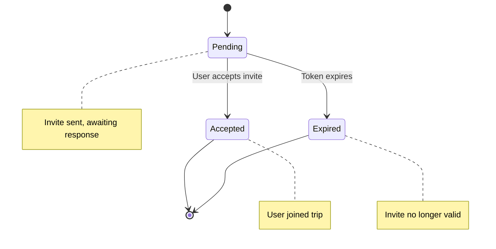

## Key State Transitions

### **User Account Flow**

- **Guest** → **Registered** → **EmailVerification** → **Verified** → **Authenticated**
- **Authenticated** → **Owner** → **PendingVerification** → **VerifiedOwner**
- **Authenticated** → **AccountLocked** (security measure)

### **Owner Verification Flow**

- **Pending** → **UnderReview** → **Verified** (admin approval)
- **Verified** → **Suspended** (admin action)

### **Campground Flow** (No Status Field)

- **NotCreated** → **Created** → **Updated** → **Created** (edit cycle)
- **Created** → **Deleted** (owner action)

### **Campsite Flow** (Based on availability field)

- **Available** ↔ **Unavailable** (owner control)
- **Available** → **Booked** (user booking)
- **Booked** → **Available** (booking ends)

### **Booking Flow** (Actual status enum)

- **Pending** → **Confirmed** (owner approval)
- **Pending/Confirmed** → **Completed** (stay finished)
- **Pending/Confirmed** → **Cancelled** (cancellation)

### **Trip Flow**

- **NotCreated** → **Created** → **Public/Private** (visibility)
- **Created** → **Updated** → **Created** (edit cycle)
- **Created** → **Deleted** (user action)

## State Management Benefits

1. **Clear Lifecycle**: Each entity has a well-defined state progression
2. **Business Rules**: States enforce business logic and constraints
3. **Audit Trail**: State changes provide history and accountability
4. **User Experience**: Clear feedback on current status
5. **System Integrity**: Prevents invalid state transitions
6. **Analytics**: State data enables business intelligence

## Implementation Considerations

- **State Validation**: Ensure only valid transitions are allowed
- **State Persistence**: Store current state in database
- **State Notifications**: Alert users of state changes
- **State History**: Track all state transitions for audit
- **State Permissions**: Control who can change states
- **State Timeouts**: Automatic state changes based on time

## Important Notes

- **Campgrounds**: No explicit status field - just exists or doesn't exist
- **Campsites**: Use `availability` boolean field, not complex status states
- **Bookings**: Simple status enum: pending, confirmed, cancelled, completed
- **Reviews**: No status field - just basic CRUD operations
- **Trips**: Use `isPublic` boolean for visibility, not status
- **Tokens**: Have expiration and usage tracking
- **Owner Verification**: Controls campground management permissions

This state diagram accurately reflects the actual implementation in your AdventureMate system!
