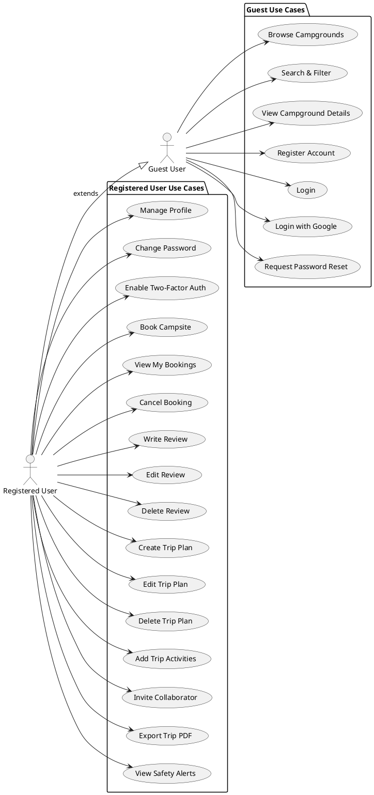
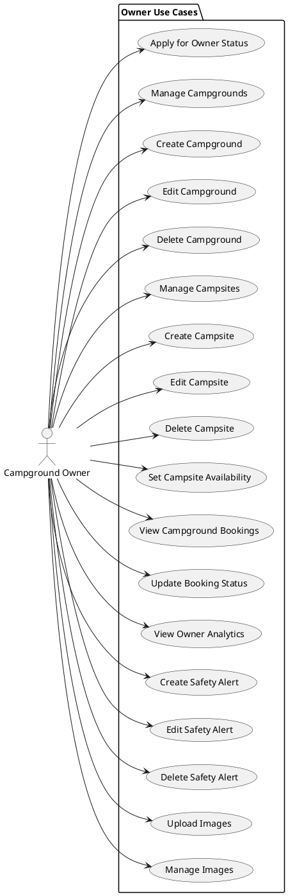
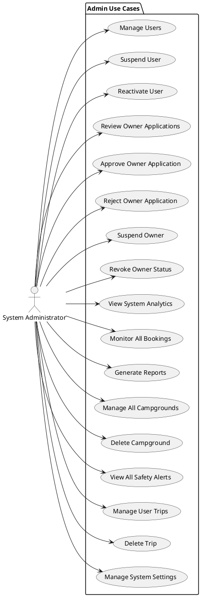
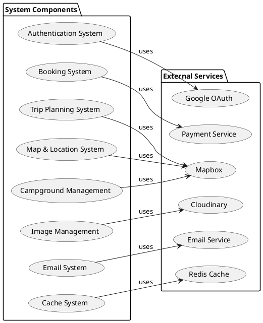

# AdventureMate - Use Case Diagrams

## Overview

This document contains focused, role-based use case diagrams for the AdventureMate camping booking and trip planning platform. Each diagram targets a specific user role for clarity and simplicity.

## 1. Guest & Registered User Use Case Diagram

## 2. Owner Use Case Diagram

## 3. Admin Use Case Diagram

## 4. External Services Integration View

## Key Features by Role

### **Guest & Registered Users**

- **Authentication**: Traditional login, Google OAuth, password reset
- **Campground Discovery**: Browse, search, filter, view details
- **Booking Management**: Book, view, cancel campsite reservations
- **Review System**: Write, edit, delete campground reviews
- **Trip Planning**: Create, edit, delete trip plans with activities
- **Collaboration**: Invite collaborators, export PDFs
- **Safety**: View safety alerts

### **Campground Owners**

- **Application Process**: Apply for owner status
- **Campground Management**: Create, edit, delete campgrounds
- **Campsite Management**: Manage individual campsites and availability
- **Booking Management**: View and update booking statuses
- **Analytics**: View owner-specific analytics
- **Safety Alerts**: Create, edit, delete safety alerts
- **Media Management**: Upload and manage images

### **System Administrators**

- **User Management**: Suspend, reactivate users
- **Owner Applications**: Review, approve, reject, suspend owners
- **System Analytics**: View comprehensive system statistics
- **Content Moderation**: Manage campgrounds, trips, safety alerts
- **System Settings**: Manage overall system configuration

### **External Services Integration**

- **Authentication**: Google OAuth for social login
- **Payments**: Payment processing for bookings
- **Media**: Cloudinary for image management
- **Maps**: Mapbox for geocoding and location services
- **Communication**: Email service for notifications
- **Performance**: Redis for caching and analytics

This approach provides much clearer, focused diagrams that follow proper PlantUML syntax and are easier to understand and explain! 🎯
