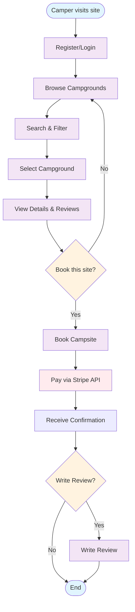
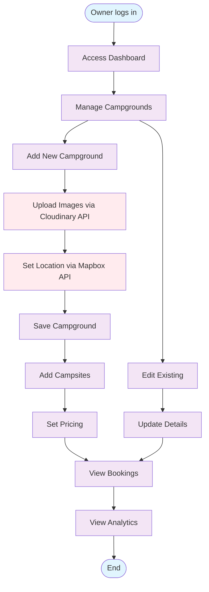
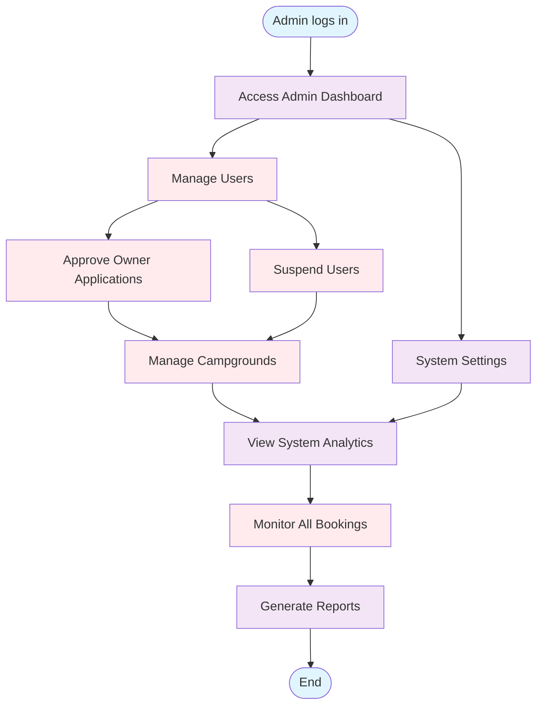
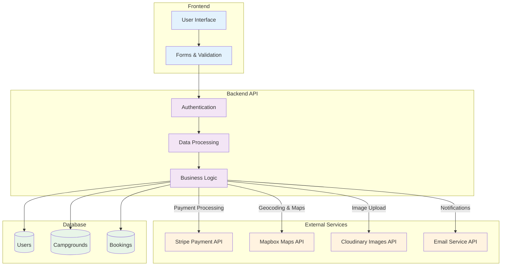

# AdventureMate - Activity Diagrams

## Overview

This document contains three separate activity diagrams showing the main user flows for different roles in the AdventureMate camping booking platform.

## 1. Camper User Flow

## 2. Campground Owner Flow

## 3. Admin Flow

## 4. System Integration Flow (Swimlanes)

## Key User Flows Summary

### **Camper Flow** (Primary User)

1. **Register/Login** → Create account or sign in
2. **Browse & Search** → Find campgrounds
3. **Select & View** → Choose campground and see details
4. **Decide** → Choose whether to book or continue browsing
5. **Book & Pay** → Reserve campsite and pay via Stripe API
6. **Review** → Optionally write review after stay

### **Owner Flow** (Campground Manager)

1. **Dashboard** → Access owner management panel
2. **Manage Campgrounds** → Add/edit campgrounds and campsites
3. **Upload & Location** → Add images via Cloudinary API, set location via Mapbox API
4. **Pricing** → Set campsite pricing
5. **Analytics** → View booking analytics and performance

### **Admin Flow** (System Administrator)

1. **Dashboard** → Access admin control panel
2. **User Management** → Approve owner applications, manage users
3. **Campground Management** → Oversee and manage all campgrounds
4. **System Monitoring** → View system analytics and reports
5. **Booking Oversight** → Monitor all platform bookings

## System Architecture

### **Frontend Layer**

- React components and user interface
- Form validation and user interactions

### **Backend Layer**

- Authentication and authorization
- Business logic and data processing
- API endpoints and routing

### **External Services**

- **Stripe API**: Payment processing
- **Mapbox API**: Maps and geolocation
- **Cloudinary API**: Image management
- **Email Service API**: Notifications and verification

### **Database Layer**

- User accounts and profiles
- Campground and campsite data
- Booking records and reviews

## Benefits of This Approach

1. **Clarity**: Each role has a focused, simple flow
2. **Decision Points**: Shows realistic user choices
3. **API Integration**: Clear labeling of external service calls
4. **Maintainability**: Easy to update individual user journeys
5. **Documentation**: Clear for different stakeholders
6. **Development**: Teams can work on different flows independently
7. **Testing**: Each flow can be tested separately

This modular approach makes the system much easier to understand and implement!
