# AdventureMate - Component Diagram

## Overview

This component diagram shows the high-level system architecture of AdventureMate, including frontend components, backend services, external integrations, and their interactions.

## Main Component Diagram

```mermaid
graph TB
    %% User Interface Layer
    subgraph UI[User Interface Layer]
        WebApp[Web Application<br/>React Frontend]
    end

    %% Frontend Components
    subgraph Frontend[Frontend Components]
        AuthUI[Authentication UI<br/>Login/Register/Profile]
        CampgroundUI[Campground UI<br/>Browse/Search/Details]
        BookingUI[Booking UI<br/>Reserve/Cancel/Manage]
        OwnerUI[Owner Dashboard<br/>Manage Campgrounds]
        AdminUI[Admin Dashboard<br/>System Management]
        TripUI[Trip Planning UI<br/>Create/Edit/Share]
    end

    %% Frontend Services
    subgraph FrontendServices[Frontend Services]
        AuthService[Authentication Service<br/>JWT/Google OAuth]
        ApiService[API Service<br/>HTTP Client]
        CacheService[Cache Service<br/>Local Storage]
        StateService[State Management<br/>Context/Redux]
    end

    %% Backend API Layer
    subgraph API[Backend API Layer]
        AuthAPI[Authentication API<br/>/api/v1/auth]
        CampgroundAPI[Campground API<br/>/api/v1/campgrounds]
        BookingAPI[Booking API<br/>/api/v1/bookings]
        OwnerAPI[Owner API<br/>/api/v1/owners]
        AdminAPI[Admin API<br/>/api/v1/admin]
        TripAPI[Trip API<br/>/api/v1/trips]
        ReviewAPI[Review API<br/>/api/v1/reviews]
        SafetyAPI[Safety Alert API<br/>/api/v1/safety]
    end

    %% Backend Services
    subgraph BackendServices[Backend Services]
        AuthService[Authentication Service<br/>JWT/2FA/Google OAuth]
        EmailService[Email Service<br/>Verification/Notifications]
        PaymentService[Payment Service<br/>Stripe Integration]
        ImageService[Image Service<br/>Cloudinary]
        MapService[Map Service<br/>Mapbox]
        CacheService[Cache Service<br/>Redis]
        LoggingService[Logging Service<br/>Winston]
    end

    %% Database Layer
    subgraph Database[Database Layer]
        MongoDB[(MongoDB<br/>Primary Database)]
        Redis[(Redis<br/>Cache Database)]
    end

    %% External Services
    subgraph External[External Services]
        GoogleOAuth[Google OAuth<br/>Authentication]
        Stripe[Stripe<br/>Payment Processing]
        Cloudinary[Cloudinary<br/>Image Management]
        Mapbox[Mapbox<br/>Maps & Geocoding]
        EmailProvider[Email Provider<br/>SMTP/SendGrid]
    end

    %% Security & Middleware
    subgraph Security[Security & Middleware]
        JWTService[JWT Service<br/>Token Management]
        RateLimiter[Rate Limiter<br/>Request Throttling]
        CORS[CORS Middleware<br/>Cross-Origin]
        Validation[Validation Middleware<br/>Input Sanitization]
        AuthMiddleware[Auth Middleware<br/>Route Protection]
    end

    %% Connections - UI to Frontend
    WebApp --> AuthUI
    WebApp --> CampgroundUI
    WebApp --> BookingUI
    WebApp --> OwnerUI
    WebApp --> AdminUI
    WebApp --> TripUI

    %% Connections - Frontend to Services
    AuthUI --> AuthService
    CampgroundUI --> ApiService
    BookingUI --> ApiService
    OwnerUI --> ApiService
    AdminUI --> ApiService
    TripUI --> ApiService

    ApiService --> CacheService
    ApiService --> StateService

    %% Connections - Frontend to Backend
    AuthService --> AuthAPI
    ApiService --> CampgroundAPI
    ApiService --> BookingAPI
    ApiService --> OwnerAPI
    ApiService --> AdminAPI
    ApiService --> TripAPI
    ApiService --> ReviewAPI
    ApiService --> SafetyAPI

    %% Connections - Backend Services
    AuthAPI --> AuthService
    CampgroundAPI --> ImageService
    CampgroundAPI --> MapService
    BookingAPI --> PaymentService
    BookingAPI --> EmailService
    OwnerAPI --> EmailService
    AdminAPI --> LoggingService
    TripAPI --> MapService

    %% Connections - Backend to Database
    AuthService --> MongoDB
    AuthService --> Redis
    ImageService --> Cloudinary
    MapService --> Mapbox
    PaymentService --> Stripe
    EmailService --> EmailProvider
    AuthService --> GoogleOAuth

    %% Connections - Security
    AuthAPI --> JWTService
    AuthAPI --> AuthMiddleware
    CampgroundAPI --> Validation
    BookingAPI --> RateLimiter
    AdminAPI --> AuthMiddleware

    %% Database Connections
    AuthService --> MongoDB
    CampgroundAPI --> MongoDB
    BookingAPI --> MongoDB
    OwnerAPI --> MongoDB
    AdminAPI --> MongoDB
    TripAPI --> MongoDB
    ReviewAPI --> MongoDB
    SafetyAPI --> MongoDB

    CacheService --> Redis

    %% Styling
    classDef uiLayer fill:#e3f2fd,stroke:#1976d2,stroke-width:2px
    classDef frontendLayer fill:#f3e5f5,stroke:#7b1fa2,stroke-width:2px
    classDef apiLayer fill:#e8f5e8,stroke:#388e3c,stroke-width:2px
    classDef backendLayer fill:#fff3e0,stroke:#f57c00,stroke-width:2px
    classDef databaseLayer fill:#fce4ec,stroke:#c2185b,stroke-width:2px
    classDef externalLayer fill:#f1f8e9,stroke:#689f38,stroke-width:2px
    classDef securityLayer fill:#e0f2f1,stroke:#00695c,stroke-width:2px

    class WebApp uiLayer
    class AuthUI,CampgroundUI,BookingUI,OwnerUI,AdminUI,TripUI,AuthService,ApiService,CacheService,StateService frontendLayer
    class AuthAPI,CampgroundAPI,BookingAPI,OwnerAPI,AdminAPI,TripAPI,ReviewAPI,SafetyAPI apiLayer
    class AuthService,EmailService,PaymentService,ImageService,MapService,CacheService,LoggingService backendLayer
    class MongoDB,Redis databaseLayer
    class GoogleOAuth,Stripe,Cloudinary,Mapbox,EmailProvider externalLayer
    class JWTService,RateLimiter,CORS,Validation,AuthMiddleware securityLayer
```

## Detailed Component Descriptions

### **User Interface Layer**

#### **Web Application**

- **Technology**: React.js with Vite
- **Features**: Responsive web interface, PWA support
- **Components**: All major UI components and pages

#### **Mobile Application**

- **Technology**: React Native (planned future expansion)
- **Features**: Native mobile experience
- **Components**: Core functionality for mobile users
- **Status**: Not yet implemented

### **Frontend Components**

#### **Authentication UI**

- **LoginForm**: Traditional email/password login
- **GoogleOAuthButton**: Social login integration
- **RegisterForm**: User registration
- **ProfilePage**: User profile management
- **PasswordReset**: Password recovery flow

#### **Campground UI**

- **CampgroundList**: Browse and search campgrounds
- **CampgroundDetail**: Detailed campground information
- **CampgroundCard**: Individual campground display
- **SearchFilters**: Advanced search functionality

#### **Booking UI**

- **BookingForm**: Create new reservations
- **BookingList**: View user bookings
- **BookingDetail**: Booking information and management
- **ReviewForm**: Write campground reviews

#### **Owner Dashboard**

- **OwnerLayout**: Owner-specific navigation
- **CampgroundManagement**: Create/edit campgrounds
- **CampsiteManagement**: Manage individual campsites
- **BookingManagement**: Handle incoming bookings
- **Analytics**: Owner performance metrics

#### **Admin Dashboard**

- **AdminLayout**: Admin-specific navigation
- **UserManagement**: Manage system users
- **OwnerApplications**: Review owner applications
- **SystemAnalytics**: System-wide statistics
- **ContentModeration**: Moderate content and users

#### **Trip Planning UI**

- **TripCreator**: Create new trip plans
- **TripEditor**: Edit existing trips
- **TripSharing**: Share trips with collaborators
- **ActivityPlanner**: Plan trip activities

### **Frontend Services**

#### **Authentication Service**

- **JWT Management**: Token storage and refresh
- **Google OAuth**: Social login integration
- **2FA Support**: Two-factor authentication
- **Session Management**: User session handling

#### **API Service**

- **HTTP Client**: Axios-based API communication
- **Request/Response Interceptors**: Error handling
- **Authentication Headers**: Automatic token inclusion
- **Retry Logic**: Network error recovery

#### **Cache Service**

- **Local Storage**: Client-side data caching
- **Session Storage**: Temporary data storage
- **Cache Invalidation**: Smart cache management
- **Offline Support**: Offline data access

#### **State Management**

- **Context API**: Global state management
- **Local State**: Component-specific state
- **State Persistence**: State across sessions
- **State Synchronization**: Real-time updates

### **Backend API Layer**

#### **Authentication API**

- **Endpoints**: `/api/v1/auth/*`
- **Features**: Login, register, password reset, Google OAuth
- **Security**: JWT tokens, 2FA, rate limiting

#### **Campground API**

- **Endpoints**: `/api/v1/campgrounds/*`
- **Features**: CRUD operations, search, filtering
- **Integrations**: Image upload, geocoding

#### **Booking API**

- **Endpoints**: `/api/v1/bookings/*`
- **Features**: Create, manage, cancel bookings
- **Integrations**: Payment processing, email notifications

#### **Owner API**

- **Endpoints**: `/api/v1/owners/*`
- **Features**: Owner management, applications
- **Integrations**: Email verification, approval workflow

#### **Admin API**

- **Endpoints**: `/api/v1/admin/*`
- **Features**: User management, analytics, moderation
- **Security**: Role-based access control

#### **Trip API**

- **Endpoints**: `/api/v1/trips/*`
- **Features**: Trip planning, collaboration
- **Integrations**: Map services, activity planning

#### **Review API**

- **Endpoints**: `/api/v1/reviews/*`
- **Features**: Review management, ratings
- **Moderation**: Content filtering

#### **Safety Alert API**

- **Endpoints**: `/api/v1/safety/*`
- **Features**: Safety alert management
- **Notifications**: Real-time alerts

### **Backend Services**

#### **Authentication Service**

- **JWT Generation**: Token creation and validation
- **Password Hashing**: Secure password storage
- **Google OAuth**: OAuth flow management
- **2FA Implementation**: Two-factor authentication

#### **Email Service**

- **Verification Emails**: Account verification
- **Password Reset**: Password recovery emails
- **Booking Confirmations**: Reservation notifications
- **Owner Applications**: Application status updates

#### **Payment Service**

- **Stripe Integration**: Payment processing
- **Refund Handling**: Cancellation refunds
- **Payment Security**: PCI compliance
- **Transaction Logging**: Payment audit trail

#### **Image Service**

- **Cloudinary Integration**: Image upload and management
- **Image Optimization**: Automatic resizing and compression
- **CDN Delivery**: Fast image delivery
- **Storage Management**: Image lifecycle management

#### **Map Service**

- **Mapbox Integration**: Maps and geocoding
- **Location Services**: Address validation
- **Directions**: Route planning
- **Geospatial Queries**: Location-based search

#### **Cache Service**

- **Redis Integration**: High-performance caching
- **Analytics Caching**: Performance optimization
- **Session Storage**: User session data
- **Cache Invalidation**: Smart cache management

#### **Logging Service**

- **Winston Logger**: Structured logging
- **Error Tracking**: Error monitoring and alerting
- **Performance Monitoring**: Application metrics
- **Audit Logging**: Security and compliance

### **Database Layer**

#### **MongoDB (Primary Database)**

- **User Collections**: Users, owners, admins
- **Content Collections**: Campgrounds, campsites, reviews
- **Transaction Collections**: Bookings, payments
- **System Collections**: Logs, analytics, settings

#### **Redis (Cache Database)**

- **Session Storage**: User sessions and tokens
- **Analytics Cache**: Performance metrics
- **Rate Limiting**: Request throttling data
- **Real-time Data**: Live updates and notifications

### **External Services**

#### **Google OAuth**

- **Authentication**: Social login integration
- **User Profile**: Google account information
- **Security**: OAuth 2.0 protocol
- **Error Handling**: Conflict resolution

#### **Stripe**

- **Payment Processing**: Credit card payments
- **Subscription Management**: Recurring payments
- **Refund Processing**: Cancellation refunds
- **Security**: PCI DSS compliance

#### **Cloudinary**

- **Image Upload**: Secure file upload
- **Image Transformation**: Automatic optimization
- **CDN Delivery**: Global content delivery
- **Storage Management**: Cloud storage

#### **Mapbox**

- **Maps Rendering**: Interactive maps
- **Geocoding**: Address to coordinates
- **Directions**: Route planning
- **Location Services**: Geographic data

#### **Email Provider**

- **SMTP/SendGrid**: Reliable email delivery
- **Template Management**: Email templates
- **Delivery Tracking**: Email analytics
- **Spam Protection**: Email deliverability

### **Security & Middleware**

#### **JWT Service**

- **Token Generation**: Secure token creation
- **Token Validation**: Request authentication
- **Token Refresh**: Automatic token renewal
- **Token Revocation**: Secure logout

#### **Rate Limiter**

- **Request Throttling**: Prevent abuse
- **IP-based Limiting**: Geographic restrictions
- **User-based Limiting**: Per-user limits
- **Dynamic Adjustments**: Adaptive limiting

#### **CORS Middleware**

- **Cross-Origin Requests**: Browser security
- **Origin Validation**: Trusted domains
- **Method Restrictions**: HTTP method control
- **Header Management**: Custom headers

#### **Validation Middleware**

- **Input Sanitization**: XSS prevention
- **Data Validation**: Schema validation
- **SQL Injection Prevention**: Database security
- **File Upload Security**: Malware protection

#### **Auth Middleware**

- **Route Protection**: Access control
- **Role-based Access**: Permission management
- **Session Validation**: User authentication
- **Audit Logging**: Security monitoring

## Component Interactions

### **Authentication Flow**

1. User submits credentials via AuthUI
2. AuthUI calls AuthService
3. AuthService communicates with AuthAPI
4. AuthAPI validates with AuthService
5. AuthService generates JWT tokens
6. Tokens stored in CacheService
7. User authenticated and redirected

### **Booking Flow**

1. User selects campsite via CampgroundUI
2. CampgroundUI calls ApiService
3. ApiService communicates with BookingAPI
4. BookingAPI validates with PaymentService
5. PaymentService processes via Stripe
6. EmailService sends confirmation
7. Booking confirmed and stored in MongoDB

### **Owner Management Flow**

1. Owner submits application via OwnerUI
2. OwnerUI calls ApiService
3. ApiService communicates with OwnerAPI
4. OwnerAPI stores in MongoDB
5. Admin reviews via AdminUI
6. EmailService notifies owner
7. Owner status updated in database

This component diagram provides a comprehensive view of the AdventureMate system architecture and component interactions! 🏕️
