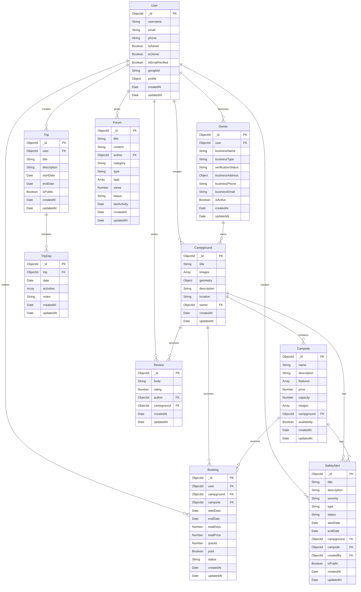

# AdventureMate - Core Business ER Diagram

## Overview

This diagram focuses on the core business features of AdventureMate - the essential entities and relationships that drive the camping booking platform. This is designed for business stakeholders, product managers, and anyone who needs to understand the main system functionality.

## Core Business ER Diagram

## Key Business Features

### **1. User Management**

- **Regular Users**: Can book campsites, write reviews, plan trips
- **Campground Owners**: Can manage campgrounds and campsites
- **Administrators**: Have special privileges for system management

### **2. Campground System**

- **Campgrounds**: Main properties with location, description, images
- **Campsites**: Individual booking units within campgrounds
- **Pricing**: Set at campsite level for flexibility
- **Availability**: Tracked per campsite with date ranges

### **3. Booking System**

- **Reservations**: Users book specific campsites for date ranges
- **Payment Tracking**: Session-based payment processing
- **Status Management**: Pending, confirmed, cancelled, completed
- **Guest Management**: Track number of guests per booking

### **4. Review System**

- **Ratings**: 1-5 star rating system
- **Reviews**: Text-based feedback for campgrounds
- **Author Attribution**: Clear tracking of who wrote each review

### **5. Trip Planning**

- **Itineraries**: Users can create detailed trip plans
- **Day-by-Day**: Structured planning with activities
- **Sharing**: Public and private trip options

### **6. Community Features**

- **Forum**: Discussion platform for camping topics
- **Categories**: Organized discussions (tips, equipment, destinations)
- **Safety Alerts**: Emergency notifications for campgrounds

## Business Workflows

### **Campground Owner Journey**

1. **User Registration** → Regular user account
2. **Owner Application** → Submit business information
3. **Verification** → Admin review and approval
4. **Campground Creation** → Add properties and campsites
5. **Booking Management** → Handle reservations and payments

### **Camper Journey**

1. **Registration** → Create user account
2. **Browse Campgrounds** → Search and filter options
3. **Make Booking** → Reserve campsite with payment
4. **Write Review** → Share experience after stay
5. **Plan Trips** → Create itineraries for future adventures

### **Community Engagement**

1. **Forum Participation** → Share tips and ask questions
2. **Safety Awareness** → Receive and acknowledge alerts
3. **Trip Sharing** → Collaborate on trip planning

This core business diagram focuses on the essential features that drive value for users and business stakeholders, making it easy to understand the main system functionality without technical implementation details.
