# AdventureMate - Technical Implementation ER Diagram

## Overview

This diagram shows the complete technical implementation of AdventureMate, including all database tables, authentication systems, audit logging, and technical infrastructure. This is designed for developers, database administrators, and technical stakeholders who need to understand the full system architecture.

## Technical Implementation ER Diagram

```mermaid
erDiagram
    %% === CORE USER MANAGEMENT ===
    User {
        ObjectId _id PK
        String username
        String email
        String phone
        String password
        Boolean isAdmin
        Boolean isOwner
        Boolean isEmailVerified
        Date emailVerifiedAt
        String googleId
        Object profile
        Number failedLoginAttempts
        Boolean accountLocked
        Date lockUntil
        Date lastLoginAt
        String lastLoginIP
        Boolean isTwoFactorEnabled
        String twoFactorSecret
        Boolean twoFactorSetupCompleted
        Array backupCodes
        Array passwordHistory
        Array ownedCampgrounds
        Array bookings
        Array reviews
        Array contacts
        Array trips
        Array sharedTrips
        Date createdAt
        Date updatedAt
    }

    %% === AUTHENTICATION & SECURITY ===
    Token {
        ObjectId _id PK
        ObjectId user FK
        String token
        String type
        String email
        Date expiresAt
        Date issuedAt
        Boolean isUsed
        Boolean isRevoked
        Date usedAt
        Date revokedAt
        String ipAddress
        String userAgent
        String reason
        Date createdAt
        Date updatedAt
    }

    %% === OWNER MANAGEMENT ===
    OwnerApplication {
        ObjectId _id PK
        ObjectId user FK
        String businessName
        String businessType
        String businessRegistrationNumber
        String taxId
        Object businessAddress
        String businessPhone
        String businessEmail
        String status
        Array documents
        ObjectId reviewedBy FK
        Date reviewedAt
        Array reviewNotes
        String rejectionReason
        Object bankingInfo
        String applicationReason
        String experience
        Number expectedProperties
        Date createdAt
        Date updatedAt
    }

    Owner {
        ObjectId _id PK
        ObjectId user FK
        String businessName
        String businessType
        String businessRegistrationNumber
        String taxId
        Object businessAddress
        String businessPhone
        String businessEmail
        String verificationStatus
        Array verificationDocuments
        Array verificationNotes
        Date verifiedAt
        ObjectId verifiedBy FK
        String verificationToken
        Date verificationTokenExpires
        Object bankingInfo
        Object settings
        Object metrics
        Array campgrounds
        Boolean isActive
        Date suspendedAt
        ObjectId suspendedBy FK
        String suspensionReason
        Date createdAt
        Date updatedAt
    }

    %% === CAMPING SYSTEM ===
    Campground {
        ObjectId _id PK
        String title
        Array images
        Object geometry
        String description
        String location
        ObjectId author FK
        ObjectId owner FK
        Array campsites
        Array reviews
        Array bookings
        Date createdAt
        Date updatedAt
    }

    Campsite {
        ObjectId _id PK
        String name
        String description
        Array features
        Number price
        Number capacity
        Array images
        ObjectId campground FK
        Array bookings
        Boolean availability
        Array bookedDates
        Date createdAt
        Date updatedAt
    }

    %% === BOOKING SYSTEM ===
    Booking {
        ObjectId _id PK
        ObjectId user FK
        ObjectId campground FK
        ObjectId campsite FK
        Date startDate
        Date endDate
        Number totalDays
        Number totalPrice
        Number guests
        String sessionId
        Boolean paid
        String status
        Date createdAt
        Date updatedAt
    }

    %% === REVIEW SYSTEM ===
    Review {
        ObjectId _id PK
        String body
        Number rating
        ObjectId author FK
        ObjectId campground FK
        Date createdAt
        Date updatedAt
    }

    %% === TRIP PLANNING ===
    Trip {
        ObjectId _id PK
        ObjectId user FK
        String title
        String description
        Date startDate
        Date endDate
        Array days
        Array collaborators
        Boolean isPublic
        Date createdAt
        Date updatedAt
    }

    TripDay {
        ObjectId _id PK
        ObjectId trip FK
        Date date
        Array activities
        String notes
        Date createdAt
        Date updatedAt
    }

    Invite {
        ObjectId _id PK
        String email
        ObjectId trip FK
        ObjectId inviter FK
        String status
        String token
        Date createdAt
        Date updatedAt
    }

    %% === FORUM SYSTEM ===
    Forum {
        ObjectId _id PK
        String title
        String content
        ObjectId author FK
        String category
        String type
        Array tags
        Boolean isSticky
        Boolean isLocked
        Boolean isPinned
        Number views
        Array upvotes
        Array downvotes
        Array replies
        String status
        Date lastActivity
        Date createdAt
        Date updatedAt
    }

    %% === SAFETY & ALERTS ===
    SafetyAlert {
        ObjectId _id PK
        String title
        String description
        String severity
        String type
        String status
        Date startDate
        Date endDate
        ObjectId campground FK
        ObjectId campsite FK
        ObjectId createdBy FK
        ObjectId updatedBy FK
        Boolean isPublic
        Boolean requiresAcknowledgement
        Array acknowledgedBy
        Date createdAt
        Date updatedAt
    }

    %% === CONTACT & COMMUNICATION ===
    Contact {
        ObjectId _id PK
        String message
        ObjectId user FK
        Date createdAt
        Date updatedAt
    }

    %% === AUDIT & LOGGING ===
    AuditLog {
        ObjectId _id PK
        ObjectId user FK
        String action
        String resource
        ObjectId resourceId
        String ipAddress
        String userAgent
        Date timestamp
        Object details
        String status
        String message
        Date createdAt
        Date updatedAt
    }

    ConversionLog {
        ObjectId _id PK
        Date timestamp
        String endpoint
        String method
        String ip
        String userAgent
        ObjectId userId FK
        Boolean successful
        String error
        Date createdAt
        Date updatedAt
    }

    DeprecationLog {
        ObjectId _id PK
        Date timestamp
        String endpoint
        String method
        String ip
        String userAgent
        ObjectId userId FK
        String deprecationVersion
        String alternativeUrl
        Date createdAt
        Date updatedAt
    }

    %% === CORE RELATIONSHIPS ===
    User ||--o{ Token : "has"
    User ||--o{ OwnerApplication : "applies"
    User ||--o{ Owner : "becomes"
    User ||--o{ Campground : "creates"
    User ||--o{ Booking : "makes"
    User ||--o{ Review : "writes"
    User ||--o{ Trip : "creates"
    User ||--o{ Invite : "sends"
    User ||--o{ Forum : "posts"
    User ||--o{ SafetyAlert : "creates"
    User ||--o{ Contact : "sends"
    User ||--o{ AuditLog : "generates"
    User ||--o{ ConversionLog : "triggers"
    User ||--o{ DeprecationLog : "uses"

    %% === OWNER RELATIONSHIPS ===
    Owner ||--o{ Campground : "owns"
    OwnerApplication ||--o{ Owner : "becomes"

    %% === CAMPING RELATIONSHIPS ===
    Campground ||--o{ Campsite : "contains"
    Campground ||--o{ Review : "receives"
    Campground ||--o{ Booking : "receives"
    Campground ||--o{ SafetyAlert : "has"

    Campsite ||--o{ Booking : "receives"
    Campsite ||--o{ SafetyAlert : "has"

    %% === TRIP RELATIONSHIPS ===
    Trip ||--o{ TripDay : "contains"
    Trip ||--o{ Invite : "invites"

    %% === FORUM RELATIONSHIPS ===
    Forum ||--o{ User : "upvotes"
    Forum ||--o{ User : "downvotes"

    %% === AUDIT RELATIONSHIPS ===
    User ||--o{ AuditLog : "audits"
    User ||--o{ ConversionLog : "converts"
    User ||--o{ DeprecationLog : "deprecates"
```

## Technical Implementation Features

### **1. Authentication & Security System**

- **Unified Token Management**: Single `Token` table with `type` field for all token types
- **Multi-Factor Authentication**: 2FA support with backup codes
- **Password History**: Track password changes for security compliance
- **Account Security**: Failed login attempts, account locking, IP tracking

### **2. Owner Management System**

- **Application Workflow**: Complete application → review → approval process
- **Document Management**: Structured document upload and verification
- **Business Verification**: Multi-step verification with admin oversight
- **Performance Metrics**: Calculated business metrics for insights

### **3. Camping System Architecture**

- **Hierarchical Structure**: Campground → Campsite relationship
- **Geospatial Support**: Geometry fields for mapping integration
- **Availability Management**: Booked dates tracking at campsite level
- **Image Management**: Cloudinary integration for media storage

### **4. Booking System Implementation**

- **Session Management**: Stripe payment integration with session tracking
- **Availability Prevention**: Double-booking prevention through date tracking
- **Status Workflow**: Complete booking lifecycle management
- **Guest Tracking**: Per-booking guest count management

### **5. Review System**

- **Reference Validation**: Pre-save middleware for data integrity
- **Rating System**: 1-5 star rating with text reviews
- **Author Attribution**: Complete audit trail for reviews

### **6. Trip Planning System**

- **Collaborative Planning**: Multi-user trip collaboration
- **Day-by-Day Structure**: Detailed itinerary management
- **Invitation System**: Secure token-based invitations
- **Visibility Control**: Public/private trip sharing

### **7. Forum System**

- **Voting System**: Upvote/downvote tracking
- **Reply Structure**: Nested replies with acceptance for Q&A
- **Moderation Tools**: Sticky, locked, pinned posts
- **Category Management**: Organized discussion topics

### **8. Safety & Alert System**

- **Multi-Level Alerts**: Campground and campsite specific alerts
- **Severity Classification**: Low to critical alert levels
- **Acknowledgment Tracking**: User acknowledgment management
- **Time-Based Validity**: Start/end date management

### **9. Comprehensive Audit System**

- **Action Logging**: Complete system action audit trail
- **Performance Monitoring**: Conversion and deprecation tracking
- **Security Audit**: Full user action history
- **Data Integrity**: Reference validation and cleanup

## Technical Benefits

### **1. Data Integrity**

- **Referential Integrity**: Foreign key constraints and validation
- **Cascade Operations**: Automatic cleanup of related data
- **Validation Middleware**: Pre-save validation for consistency

### **2. Performance Optimization**

- **Strategic Indexing**: Optimized database indexes
- **Efficient Queries**: Normalized structure reduces redundancy
- **Caching Integration**: Redis support for frequently accessed data

### **3. Scalability**

- **Modular Design**: Feature-focused table organization
- **Extensible Architecture**: Easy to add new features
- **Audit Support**: Complete history for compliance

### **4. Security**

- **Token Management**: Secure token lifecycle management
- **Access Control**: Role-based permissions system
- **Audit Trail**: Complete action logging

### **5. Business Logic**

- **Workflow Support**: Complete business process management
- **Status Tracking**: Multi-state entity management
- **Metrics Calculation**: Performance tracking and analytics

This technical implementation diagram provides developers with the complete system architecture, including all database tables, relationships, and technical considerations for building and maintaining the AdventureMate platform.
